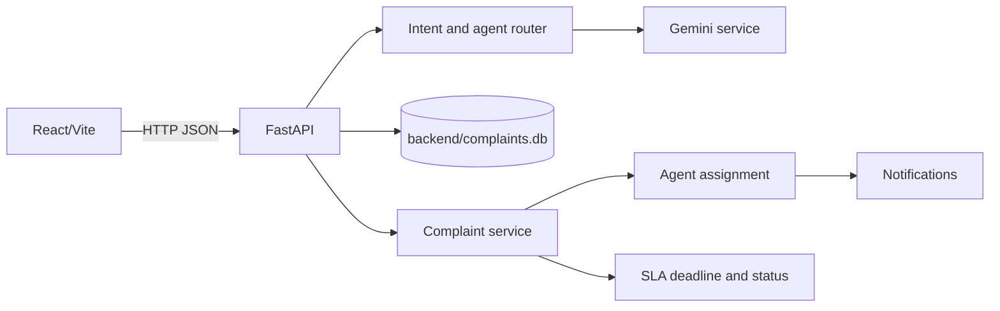

# Customer Support AI Architecture

## Runtime flow

## Current modules

- `frontend/src`: React chat, complaint, analytics, and agent-management views.
- `backend/app/api`: HTTP boundaries for chat, conversations, complaints, agents, notifications, analytics, and authentication.
- `backend/app/agents`: intent detection and specialist agents.
- `backend/app/services`: database-backed business logic.
- `backend/database/db.py`: canonical SQLite schema and migrations.

## Data ownership

All backend services use `backend/complaints.db` through `database.db.get_connection()`. Conversations use `conversations` and `messages`; complaints use `complaints` and `complaint_activity`; support operations use `agents`, `notifications`, and user roles.

## Production gaps

Replace SQLite with PostgreSQL for concurrent production workloads, add authentication dependencies to protected routes, move Gemini calls behind timeouts/retries, add structured logging, and configure CORS from deployment environment variables.
