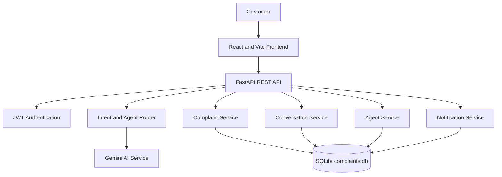

# Customer Support AI

An AI-powered customer support and complaint management system built with React, FastAPI, Python, SQLite, and AI-based agent routing.

Customers can receive intelligent support responses, create complaint tickets, and track conversations. Support teams can manage complaints, agent availability, assignments, SLA data, notifications, and analytics from one workspace.

## Features

### Customer Support Chat

- AI-powered customer conversations
- Intent detection and specialist agent routing
- Billing, technical, product, complaint, and FAQ support
- Conversation history and multiple conversations
- Automatic complaint creation for supported issues
- Ticket IDs in assistant responses
- Customer-facing support-agent availability status

### Complaint Management

- Automatic complaint creation
- Unique ticket IDs
- Search, status filtering, priority filtering, and sorting
- Complaint details and activity timeline
- Status management: `OPEN`, `PENDING`, `RESOLVED`, `CLOSED`
- Priority management: `LOW`, `MEDIUM`, `HIGH`, `URGENT`
- Category management
- Internal admin notes
- Team and individual-agent assignment
- SLA deadline and status fields

### Support Agent Management

- Create, edit, and delete support agents
- Organize agents by team
- Availability states: `AVAILABLE`, `BUSY`, `OFFLINE`
- Agent workload reporting
- Automatic assignment to the least-loaded available agent
- Customer-safe aggregate availability endpoint

### Notifications

- Assignment notifications
- Read/unread notification state
- Notification listing and deletion

### Analytics

- Total conversations and complaints
- Open, pending, resolved, and closed complaint counts
- Agent routing statistics
- Complaint counts by category and priority
- SLA status distribution

### Authentication Foundation

- Customer registration
- JWT login tokens
- User roles: `CUSTOMER`, `SUPPORT_AGENT`, `ADMIN`

> Authentication endpoints are implemented as a foundation. Role-based protection still needs to be enforced across all administrative routes before production deployment.

## System Architecture



## Tech Stack

### Frontend

- React 19
- Vite
- Axios
- Recharts
- JavaScript and CSS

### Backend

- Python
- FastAPI
- Uvicorn
- Pydantic and pydantic-settings
- python-jose
- python-dotenv

### Database

- SQLite
- Shared database file: `backend/complaints.db`
- Automatic schema initialization and migrations through `database/db.py`

### AI

- Gemini API
- Intent detection
- Specialist agent routing
- Complaint classification
- Priority, category, sentiment, and urgency analysis

## Project Structure

```text
customer-support-ai/
├── backend/
│   ├── app/
│   │   ├── agents/
│   │   │   ├── billing_agent.py
│   │   │   ├── complaint_agent.py
│   │   │   ├── faq_agent.py
│   │   │   ├── intent_detector.py
│   │   │   ├── product_agent.py
│   │   │   ├── router.py
│   │   │   └── technical_agent.py
│   │   ├── api/
│   │   │   ├── admin.py
│   │   │   ├── agent.py
│   │   │   ├── auth.py
│   │   │   ├── chat.py
│   │   │   ├── complaint.py
│   │   │   ├── conversations.py
│   │   │   ├── history.py
│   │   │   └── notifications.py
│   │   ├── core/
│   │   │   └── config.py
│   │   ├── memory/
│   │   │   └── chat_memory.py
│   │   └── services/
│   │       ├── agent_service.py
│   │       ├── auth_service.py
│   │       ├── complaint_service.py
│   │       ├── conversation_service.py
│   │       ├── gemini_service.py
│   │       ├── history_service.py
│   │       └── notification_service.py
│   ├── database/
│   │   └── db.py
│   ├── main.py
│   ├── requirements.txt
│   ├── .env.example
│   └── .env
├── frontend/
│   ├── src/
│   │   ├── components/
│   │   │   ├── AgentsPage.jsx
│   │   │   ├── AnalyticsDashboard.jsx
│   │   │   ├── ChatBox.jsx
│   │   │   ├── ComplaintDetails.jsx
│   │   │   ├── ComplaintPanel.jsx
│   │   │   ├── InputBox.jsx
│   │   │   └── Sidebar.jsx
│   │   ├── services/
│   │   │   └── api.js
│   │   ├── App.jsx
│   │   ├── App.css
│   │   └── main.jsx
│   ├── package.json
│   └── vite.config.js
├── ARCHITECTURE.md
├── API_DOCUMENTATION.md
├── .gitignore
└── README.md
```

## Installation

### 1. Clone the repository

```powershell
git clone https://github.com/YOUR-USERNAME/customer-support-ai.git
cd customer-support-ai
```

### 2. Configure the backend

```powershell
cd backend
python -m venv .venv
.\.venv\Scripts\Activate.ps1
python -m pip install -r requirements.txt
```

Create a local `.env` file from the example:

```powershell
Copy-Item .env.example .env
```

Set the required values in `backend/.env`:

```env
GEMINI_API_KEY=your-gemini-api-key
JWT_SECRET=use-a-long-random-secret
JWT_ALGORITHM=HS256
ACCESS_TOKEN_MINUTES=60
```

Never commit `.env` or expose API keys in source control. Rotate any key that has previously been exposed.

### 3. Run the backend

From the `backend` directory:

```powershell
python -m uvicorn main:app --reload --host 127.0.0.1 --port 8000
```

Backend URL: http://127.0.0.1:8000

API documentation: http://127.0.0.1:8000/docs

The SQLite database is created automatically at `backend/complaints.db` when the application starts.

### 4. Run the frontend

Open a second terminal:

```powershell
cd frontend
npm install
npm run dev
```

Frontend URL: http://localhost:5173

Optional frontend API configuration:

```env
VITE_API_URL=http://127.0.0.1:8000
```

## API Endpoints

### Chat and conversations

```text
POST /chat/
GET  /history/
GET  /conversations/
POST /conversations/
GET  /conversations/{conversation_id}
POST /conversations/{conversation_id}/messages
PUT  /conversations/{conversation_id}/title
```

### Complaints

```text
GET /complaint/list
GET /complaint/{ticket_id}
GET /complaint/{ticket_id}/activity
PUT /complaint/{ticket_id}/status
PUT /complaint/{ticket_id}/priority
PUT /complaint/{ticket_id}/category
PUT /complaint/{ticket_id}/note
PUT /complaint/{ticket_id}/assign
```

### Support agents

```text
POST /agent/create
GET  /agent/list
GET  /agent/availability
GET  /agent/{agent_id}
PUT  /agent/{agent_id}
DELETE /agent/{agent_id}
GET  /agent/{agent_id}/workload
POST /agent/auto-assign/{ticket_id}
```

`GET /agent/availability` is intended for customers and returns only aggregate availability. Agent names, emails, and management controls belong to the internal support interface.

### Notifications, analytics, and authentication

```text
GET    /notifications
PUT    /notifications/{notification_id}/read
DELETE /notifications/{notification_id}
GET    /admin/stats
POST   /auth/register
POST   /auth/login
```

## Complaint Workflow

```text
Customer message
      ↓
Intent detection
      ↓
Specialist agent router
      ↓
AI response
      ↓
Complaint detection when applicable
      ↓
Create ticket and activity record
      ↓
Calculate category, priority, sentiment, urgency, and recommended action
      ↓
Assign team or available support agent
      ↓
Set SLA deadline and create notification
      ↓
Support team updates ticket
      ↓
Resolve or close complaint
```

## Current Limitations

- SQLite is suitable for local development but should be replaced with PostgreSQL for production concurrency.
- JWT tokens are issued, but route-level role enforcement is not complete.
- Gemini calls need production timeouts, retries, and fallback handling.
- RAG document upload, embeddings, vector search, and source citations are not implemented yet.
- Email delivery and real-time human-agent chat are not implemented yet.
- Automated backend and frontend test suites should be added.

## Roadmap

- Enforce role-based access on administrative APIs.
- Add RAG knowledge-base upload for PDF, DOCX, TXT, and CSV files.
- Add embeddings, vector search, and cited answers.
- Add SLA breach detection and escalation notifications.
- Add email and real-time agent notifications.
- Migrate from SQLite to PostgreSQL.
- Add Docker, structured logging, monitoring, and production deployment.
- Add automated test coverage.

## Author

**Kalavanthula Sekhar**  
AI and Machine Learning Engineer | Python Developer | Agentic AI Developer

## Project Goal

The goal of this project is to demonstrate a complete AI-powered customer support workflow combining artificial intelligence, agent routing, complaint management, support operations, analytics, and full-stack development.

## Repository Safety

The repository ignores environment files, database files, Python virtual environments, Node modules, build output, and IDE metadata through `.gitignore`. The database is intentionally generated locally by the backend instead of being uploaded to GitHub.
