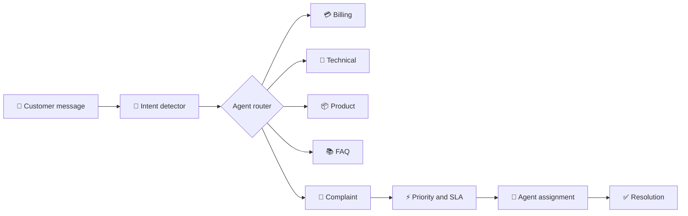

<div align="center">

# 🤖 Customer Support AI

### Intelligent conversations. Faster resolutions. Happier customers.

An AI-powered support workspace that understands customer intent, routes requests to specialist agents, creates complaint tickets, and helps support teams resolve issues from one place.

[](backend)
[](frontend)
[](backend/requirements.txt)
[](backend/database/db.py)

</div>

---

## ✨ What It Does

```text
Customer question → AI intent detection → Specialist agent → Helpful answer
                                      ↘ Complaint ticket → Priority → Assignment → Resolution
```

Customer Support AI combines an AI chat assistant with an internal support-operations workspace. Customers get a fast first response, while teams get structured tickets, activity history, agent availability, workload routing, SLA data, and analytics.

## 🌟 Highlights

| Customer experience | Support operations |
| --- | --- |
| 💬 AI-powered support chat | 🎫 Automatic complaint tickets |
| 🧠 Billing, technical, product, FAQ, and complaint routing | 👥 Agent and team management |
| 🔎 Conversation history | ⚡ Priority and status workflows |
| 🟢 Live aggregate agent availability | 🤖 Automatic least-loaded assignment |
| 📌 Ticket IDs and clear responses | 🔔 Assignment notifications |

## 🧭 How It Works



## 🧩 Feature Tour

### 💬 Customer support chat

- Intelligent intent detection and specialist routing
- Billing, technical, product, complaint, and FAQ agents
- Conversation history and multiple conversations
- Automatic scrolling and suggested questions
- Customer-facing agent availability indicator

### 🎫 Complaint management

- Automatic ticket creation with unique IDs
- Search, filtering, sorting, and detailed ticket view
- Statuses: `OPEN`, `PENDING`, `RESOLVED`, `CLOSED`
- Priorities: `LOW`, `MEDIUM`, `HIGH`, `URGENT`
- Categories, internal notes, team assignment, and activity timeline
- SLA deadline and status fields

### 👥 Support operations

- Create, edit, and remove support agents
- Set availability: `AVAILABLE`, `BUSY`, or `OFFLINE`
- Track open-complaint workload
- Automatically assign a complaint to the least-loaded available agent
- Notify agents when complaints are assigned
- View operational analytics by agent, category, priority, and SLA state

### 🔐 Authentication foundation

- Customer registration
- JWT login tokens
- Roles: `CUSTOMER`, `SUPPORT_AGENT`, and `ADMIN`

> Role-based route protection is still a production hardening task.

## 🖥️ Screens

| Chat workspace | Support operations |
| --- | --- |
| 💬 Ask questions and receive AI responses | 📊 Review support analytics |
| 🎫 Create and track complaint tickets | 👥 Manage agent availability |
| 📚 Reopen previous conversations | 🔔 Follow assignment notifications |

## 🛠️ Tech Stack

- **Frontend:** React 19, Vite, Axios, Recharts, JavaScript, CSS
- **Backend:** Python, FastAPI, Uvicorn, Pydantic
- **AI:** Gemini API, intent detection, agent routing, complaint analysis
- **Database:** SQLite with automatic initialization and migrations
- **Security foundation:** JWT via `python-jose`

## 📁 Project Structure

```text
customer-support-ai/
├── backend/
│   ├── app/
│   │   ├── agents/          # Specialist AI agents and routing
│   │   ├── api/             # FastAPI route modules
│   │   ├── core/            # Configuration
│   │   └── services/        # Business logic and persistence
│   ├── database/db.py       # Canonical SQLite schema
│   ├── main.py              # FastAPI application entry point
│   ├── requirements.txt
│   └── .env.example
├── frontend/
│   ├── src/components/      # Chat, complaints, analytics, agents
│   ├── src/services/api.js
│   └── src/App.jsx
├── ARCHITECTURE.md
├── API_DOCUMENTATION.md
├── .gitignore
└── README.md
```

## 🚀 Quick Start

### 1. Backend

```powershell
cd backend
python -m venv .venv
.\.venv\Scripts\Activate.ps1
python -m pip install -r requirements.txt
Copy-Item .env.example .env
python -m uvicorn main:app --reload --host 127.0.0.1 --port 8000
```

Backend: http://127.0.0.1:8000  
API docs: http://127.0.0.1:8000/docs

Configure `backend/.env`:

```env
GEMINI_API_KEY=replace-with-your-gemini-api-key
JWT_SECRET=use-a-long-random-secret
JWT_ALGORITHM=HS256
ACCESS_TOKEN_MINUTES=60
```

### 2. Frontend

Open a second terminal:

```powershell
cd frontend
npm install
npm run dev
```

Frontend: http://localhost:5173

Optional API override:

```env
VITE_API_URL=http://127.0.0.1:8000
```

## 🔌 Main API Routes

<details>
<summary>Click to expand the API route list</summary>

### Chat and conversations

```text
POST /chat/
GET  /history/
GET  /conversations/
POST /conversations/
GET  /conversations/{conversation_id}
POST /conversations/{conversation_id}/messages
PUT  /conversations/{conversation_id}/title
```

### Complaints

```text
GET /complaint/list
GET /complaint/{ticket_id}
GET /complaint/{ticket_id}/activity
PUT /complaint/{ticket_id}/status
PUT /complaint/{ticket_id}/priority
PUT /complaint/{ticket_id}/category
PUT /complaint/{ticket_id}/note
PUT /complaint/{ticket_id}/assign
```

### Agents and availability

```text
POST /agent/create
GET  /agent/list
GET  /agent/availability
GET  /agent/{agent_id}
PUT  /agent/{agent_id}
DELETE /agent/{agent_id}
GET  /agent/{agent_id}/workload
POST /agent/auto-assign/{ticket_id}
```

### Notifications, analytics, and authentication

```text
GET    /notifications
PUT    /notifications/{notification_id}/read
DELETE /notifications/{notification_id}
GET    /admin/stats
POST   /auth/register
POST   /auth/login
```

More details: [API_DOCUMENTATION.md](API_DOCUMENTATION.md)

</details>

## 🗺️ Roadmap

- [x] AI chat and specialist routing
- [x] Complaint and conversation management
- [x] Agent management and availability
- [x] Automatic assignment foundation
- [x] Notifications and analytics foundation
- [x] JWT authentication foundation
- [ ] Enforce role-based API permissions
- [ ] Add SLA breach detection and escalation
- [ ] Add RAG knowledge-base upload and source citations
- [ ] Add email and real-time human-agent chat
- [ ] Migrate from SQLite to PostgreSQL
- [ ] Add Docker, monitoring, and deployment
- [ ] Add automated test coverage

## 🔒 Repository Safety

- `.env` files are ignored and must never be committed.
- Database files are ignored and created automatically by `init_db()`.
- Python virtual environments, Node modules, build output, and IDE files are ignored.
- Rotate any API key that has ever been exposed.

## 📚 Documentation

- [Architecture](ARCHITECTURE.md)
- [API documentation](API_DOCUMENTATION.md)
- [Backend setup](backend/requirements.txt)
- [Frontend setup](frontend/package.json)

## 👨‍💻 Author

**Kalavanthula Sekhar**  
AI and Machine Learning Engineer · Python Developer · Agentic AI Developer

<div align="center">

### ⭐ Build better support, one conversation at a time.

</div>
